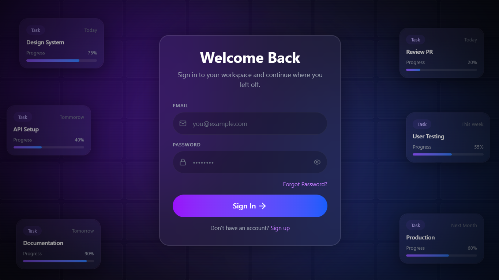
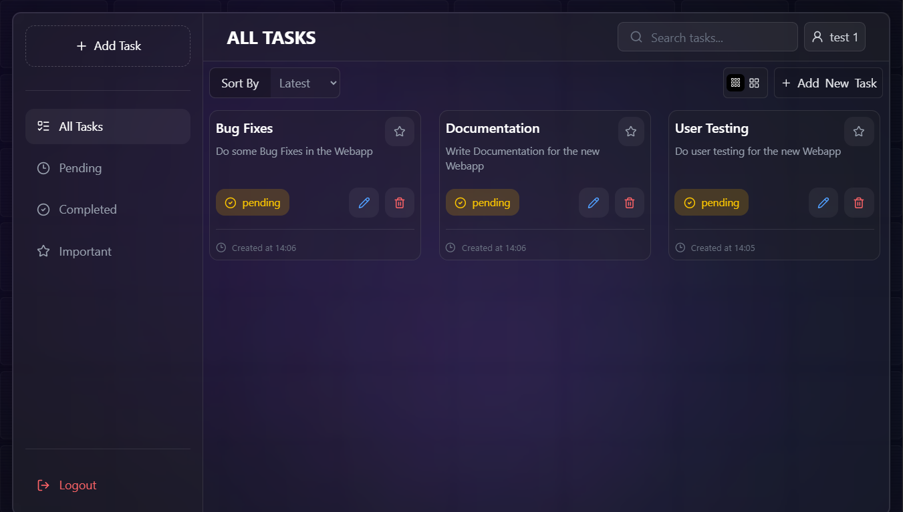

# Task Manager

A modern full-stack Task Management application built with the MERN stack. Users can register, log in securely, create and manage tasks, mark tasks as completed, filter and search tasks, and organize important tasks in a clean glassmorphism-inspired interface.

---

## Live Demo

Frontend: [https://adityaraj-task-manager.vercel.app/](https://adityaraj-task-manager.vercel.app/)

---

## Screenshot




---

## Features

### Authentication

* User Registration
* User Login
* JWT Authentication
* Protected Routes
* Persistent Login State

### Task Management

* Create Tasks
* Edit Tasks
* Delete Tasks
* Mark Tasks as Completed or Pending
* Mark Tasks as Important
* View Task Creation Time

### Organization

* Filter Tasks

  * All Tasks
  * Pending Tasks
  * Completed Tasks
  * Important Tasks
* Search Tasks by Title or Description
* Sort Tasks by Latest or Oldest

### User Interface

* Glassmorphism Design
* Responsive Layout
* Mobile Sidebar Navigation
* Dashboard Analytics Layout
* Smooth User Experience

---

## 🛠️ Tech Stack

### Frontend

* React
* React Router
* Tailwind CSS
* Axios
* Lucide React

### Backend

* Node.js
* Express.js
* JWT Authentication
* bcryptjs

### Database

* MongoDB Atlas
* Mongoose

### Deployment

* Vercel (Frontend)
* Render (Backend)

---

## 📂 Project Structure

```
task-manager/
│
├── frontend/
│   ├── src/
│   ├── public/
│   └── package.json
│
├── backend/
│   ├── controllers/
│   ├── middleware/
│   ├── models/
│   ├── routes/
│   ├── server.js
│   └── package.json
│
└── README.md
```

---

## ⚙️ Installation

### Clone Repository

```bash
git clone https://github.com/Adityarajbind/task-manager.git
cd task-manager
```

---

## Backend Setup

Navigate to backend:

```bash
cd backend
npm install
```

Create a `.env` file:

```env
PORT=5000
MONGO_URI=your_mongodb_connection_string
JWT_SECRET=your_jwt_secret_key
FRONTEND_URL=http://localhost:5173
```

Start backend:

```bash
npm run dev
```

Backend runs on:

```
http://localhost:5000
```

---

## Frontend Setup

Navigate to frontend:

```bash
cd frontend
npm install
```

Create a `.env` file:

```env
VITE_API_URL=http://localhost:5000/api
```

Start frontend:

```bash
npm run dev
```

Frontend runs on:

```
http://localhost:5173
```

---

## API Endpoints

### Authentication

| Method | Endpoint           | Description   |
| ------ | ------------------ | ------------- |
| POST   | /api/auth/register | Register User |
| POST   | /api/auth/login    | Login User    |

### Tasks

| Method | Endpoint                 | Description      |
| ------ | ------------------------ | ---------------- |
| GET    | /api/tasks               | Get All Tasks    |
| POST   | /api/tasks               | Create Task      |
| PUT    | /api/tasks/:id           | Update Task      |
| DELETE | /api/tasks/:id           | Delete Task      |
| PATCH  | /api/tasks/:id/status    | Toggle Status    |
| PATCH  | /api/tasks/:id/important | Toggle Important |

---

## Author

Adityaraj Bind
Built as a MERN Stack project to practice full-stack development, authentication, REST APIs, and modern React application architecture.
